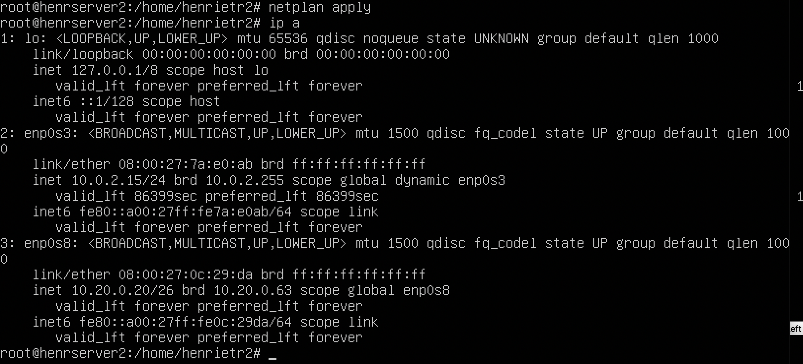
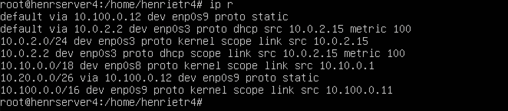
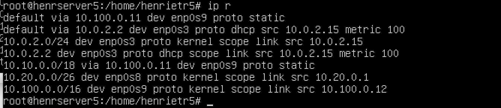
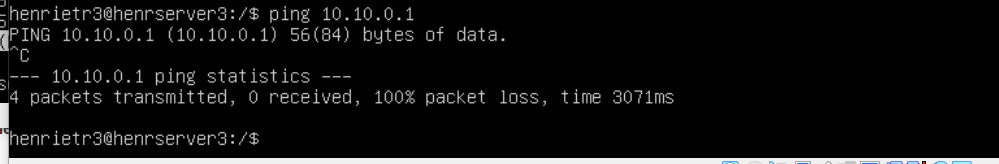

# Linux Network

## Оглавление:

1. [Инструмент ipcalc](#part-1-инструмент-ipcalc)
2. [Статическая маршрутизация между двумя машинами](#part-2-статическая-маршрутизация-между-двумя-машинами)
3. [Утилита iperf3](#part-3-утилита-iperf3)
4. [Сетевой экран](#part-4-сетевой-экран)
5. [Статическая маршрутизация сети](#part-5-статическая-маршрутизация-сети)
6. [Динамическая настройка IP с помощью DHCP](#part-6-динамическая-настройка-ip-с-помощью-dhcp)
7. [NAT](#part-7-nat)
8. [Знакомство с SSH Tunnels](#part8-bonus-знакомство-с-ssh-tunnels)


## Part 1. Инструмент ipcalc
### Part 1.1. Сети и маски

 - Определить и записать в отчет:

1. Адрес сети 192.167.38.54/13 - 192.160.0.0: 


2. перевод маски 255.255.255.0 в префиксную и двоичную запись - /24, 11111111.11111111.11111111.00000000: 


/15 в обычную и двоичную - 255.254.0.0, 11111111.11111110.00000000.00000000: 


11111111.11111111.11111111.11110000 в обычную и префиксную - 255.255.255.240, /28: 


3. Минимальный и максимальный хост в сети 12.167.38.4 при масках: /8 - HostMin - 12.0.0.1 - HostMax - 12.255.255.254: 


11111111.11111111.00000000.00000000: 


255.255.254.0: 


/4: 


### Part 1.2. localhost

 - Определить и записать в отчёт, можно ли обратиться к приложению, работающему на localhost, со следующими IP: 194.34.23.100 - Нет, 127.0.0.2 - Да, 127.1.0.1 - Да, 128.0.0.1 - Нет: 


### Part 1.3. Диапазоны и сегменты сетей

 - Определить и записать в отчет:

1. какие из перечисленных IP можно использовать в качестве публичного, а какие только в качестве частных: 10.0.0.45, 134.43.0.2, 192.168.4.2, 172.20.250.4, 172.0.2.1, 192.172.0.1, 172.68.0.2, 172.16.255.255, 10.10.10.10, 192.169.168.1

В качестве публичных можно использовать: 134.43.0.2, 172.0.2.1, 172.68.0.2, 192.169.168.1

Только в качестве частных можно использовать: 10.0.0.45, 192.168.4.2, 172.20.250.4,192.172.0.1, 172.16.255.255, 10.10.10.10 

2. какие из перечисленных IP адресов шлюза возможны у сети 10.10.0.0/18: 10.0.0.1, 10.10.0.2, 10.10.10.10, 10.10.100.1, 10.10.1.255: 


Ответы: 

10.10.0.2
10.10.10.10
10.10.1.255

## Part 2. Статическая маршрутизация между двумя машинами.

- Поднять 2 виртуальные машины

- С помощью команды ip a посмотреть существующие сетевые интерфейсы: 

 

 

- Описать сетевой интерфейс, соответствующий внутренней сети, на обеих машинах и задать следующие адреса и маски: ws1 - 192.168.100.10, маска /16, ws2 - 172.24.116.8, маска /12: \
ws1: 

 

 

 

ws2: 
 

 

 

### Part 2.1. Добавление статического маршрута вручную.

- Добавить статический маршрут от одной машины до другой и обратно при помощи команды вида ip r add.

- Пропинговать соединение между машинами: 


 

### Part 2.2. Добавление статического маршрута с сохранением.

- Перезапустить машины

- Добавить статический маршрут от одной машины до другой с помощью файла etc/netplan/00-installer-config.yaml.

- Пропинговать соединение между машинами:


 


## Part 3. Утилита iperf3


### Part 3.1. Скорость соединения.

- Перевести и записать в отчёт:
    1. 8 Mbps = 1 MB/s;
    2. 100 MB/s = 819200 Kbps;
    3. 1 Gbps = 1000 Mbps;

### Part 3.2. Утилита iperf3

- Измерить скорость соединения между ws1 и ws2:

ws1 выступает в роли сервера: 


ws2 выступает в роли клиента: 

 

## Part 4. Сетевой экран

### Part 4.1. Утилита iptables

1. Hа ws1 применить стратегию когда в начале пишется запрещающее правило, а в конце пишется разрешающее правило (это касается пунктов 4 и 5).

2. Hа ws2 применить стратегию когда в начале пишется разрешающее правило, а в конце пишется запрещающее правило (это касается пунктов 4 и 5).

3. Oткрыть на машинах доступ для порта 22 (ssh) и порта 80 (http).

4. Запретить echo reply (машина не должна "пинговаться”, т.е. должна быть блокировка на OUTPUT).

5. Pазрешить echo reply (машина должна "пинговаться").

 


- Разница между подходами заключается в том, что при первой стратегии первой подходящей командой является запрет, а при второй разрешение. Следовательно, применяется только первое подходящее правило, а остальные игнорируются.

### Part 4.2. Утилита nmap

- Командой ping найти машину, которая не "пингуется", после чего утилитой nmap показать, что хост машины запущен.

Исходя из скриншотов прошлого задания, можно понять, что машина ws1 не пингуется. Поэтому запускаем утилиту nmap.


## Part 5. Статическая маршрутизация сети

- Поднять 5 виртуальных машин

### 5.1. Настройка адресов машин

- ws11


- ws21




- ws 22


- r1


- r2


- Перезапустить сервис сети. Если ошибок нет, то командой ip -4 a проверить, что адрес машины задан верно. Также пропинговать ws22 с ws21. Аналогично пропинговать r1 с ws11.


### Part 5.2. Включение переадресации IP-адресов

- Для включения переадресации IP, выполните команду на роутерах:

    ```sysctl -w net.ipv4.ip_forward```

    1. r1:

    

    2. r2:

    

- Откройте файл /etc/sysctl.conf и добавьте в него следующую строку:

    ```net.ipv4.ip_forward = 1```

    1. r1:

    

    2. r2:

    

### Part 5.3. Установка маршрута по-умолчанию

- Настроить маршрут по-умолчанию (шлюз) для рабочих станций.

    1. ws11:

    

    

    2. ws21:

    

    

    3. ws22:

    

    

    4. r1:

    

    

    5. r2:

    

    

- Пропинговать с ws11 роутер r2 и показать на r2, что пинг доходит. Для этого использовать команду:
    ```tcpdump -tn -i eth1```

    

    

### Part 5.4. Добавление статических маршрутов

- Добавить в роутеры r1 и r2 статические маршруты в файле конфигураций.

    1. r1:

    

    

    1. r2:

    

    

- Запустить команды на ws11:
    ```ip r list 10.10.0.0/[маска сети]``` и ```ip r list 0.0.0.0/0```

    

    В отчёте объяснить, почему для адреса 10.10.0.0/[маска сети] был выбран маршрут, отличный от 0.0.0.0/0, хотя он попадает под маршрут по-умолчанию.

- Так как маршрут по умолчанию имеет более низкий приоритет, чем маршрут, установленный нами.

### Part 5.5. Построение списка маршрутизаторов

- Запустить на r1 команду дампа:
    ```tcpdump -tnv -i eth0```

    

- При помощи утилиты traceroute построить список маршрутизаторов на пути от ws11 до ws21:

    

- Принцип построения пути при помощи traceroute:
Для определения промежуточных маршрутизаторов traceroute отправляет серию пакетов данных целевому узлу, при этом каждый раз увеличивая на 1 значение поля TTL («время жизни»). Это поле обычно указывает максимальное количество маршрутизаторов, которое может быть пройдено пакетом. Первый пакет отправляется с TTL, равным 1, и поэтому первый же маршрутизатор возвращает обратно сообщение ICMP, указывающее на невозможность доставки данных. Traceroute фиксирует адрес маршрутизатора, а также время между отправкой пакета и получением ответа (эти сведения выводятся на монитор компьютера). Затем traceroute повторяет отправку пакета, но уже с TTL, равным 2, что позволяет первому маршрутизатору пропустить пакет дальше.
Процесс повторяется до тех пор, пока при определённом значении TTL пакет не достигнет целевого узла. При получении ответа от этого узла процесс трассировки считается завершённым.

### Part 5.6. Использование протокола ICMP при маршрутизации

- Запустить на r1 перехват сетевого трафика, проходящего через eth0 с помощью команды:

    ```tcpdump -n -i eth0 icmp```

    

- Пропинговать с ws11 несуществующий IP (например, 10.30.0.111) с помощью команды:

    ```ping -c 1 10.30.0.111``` 

    

## Part 6.  Динамическая настройка IP с помощью DHCP

- Для r2 настроить в файле /etc/dhcp/dhcpd.conf конфигурацию службы DHCP:

    

- в файле resolv.conf прописать nameserver 8.8.8.8.

    

- Перезагрузить службу DHCP командой systemctl restart isc-dhcp-server. Машину ws21 перезагрузить при помощи reboot и через ip a показать, что она получила адрес. Также пропинговать ws22 с ws21.

    

    

    

- Указать MAC адрес у ws11, для этого в etc/netplan/00-installer-config.yaml надо добавить строки: macaddress: 10:10:10:10:10:BA, dhcp4: true.

    

- Для r1 настроить аналогично r2, но сделать выдачу адресов с жесткой привязкой к MAC-адресу (ws11). Провести аналогичные тесты.

    

    

    

- Запросить с ws21 обновление ip адреса.

    1. ip a до обновления:

    

    2. Вызываем команды sudo dhclient -r enp0s8, а потом sudo dhclint enp0s8 (Первая для сброса адресов, а вторая для установки нового адреса). Затем вызываем ip a после обновления:

    

## Part 7. NAT

- В файле /etc/apache2/ports.conf на ws22 и r1 изменить строку Listen 80 на Listen 0.0.0.0:80, то есть сделать сервер Apache2 общедоступным.

    

- Запустить веб-сервер Apache командой service apache2 start на ws22 и r1.

    

    

- Добавить в фаервол, созданный по аналогии с фаерволом из Части 4, на r2 следующие правила:

    1. Удаление правил в таблице filter - iptables -F.

    2. Удаление правил в таблице "NAT" - iptables -F -t nat.

    3. Отбрасывать все маршрутизируемые пакеты - iptables --policy FORWARD DROP.

- Запускать файл также, как в Части 4.

- Проверить соединение между ws22 и r1 командой ping.

    

    

    

- Добавить в файл ещё одно правило:

    4. Pазрешить маршрутизацию всех пакетов протокола ICMP.

- Запускать файл также, как в Части 4.

- Проверить соединение между ws22 и r1 командой ping.

    

    

- Добавить в файл ещё два правила:

    5. Включить SNAT, а именно маскирование всех локальных ip из локальной сети, находящейся за r2 (по обозначениям из Части 5 - сеть 10.20.0.0).

    6. Bключить DNAT на 8080 порт машины r2 и добавить к веб-серверу Apache, запущенному на ws22, доступ извне сети.

- Запускать файл также, как в Части 4.

    

- Проверить соединение по TCP для SNAT, для этого с ws22 подключиться к серверу Apache на r1 командой:

    ```telnet [адрес] [порт]```

- Проверить соединение по TCP для DNAT, для этого с r1 подключиться к серверу Apache на ws22 командой telnet (обращаться по адресу r2 и порту 8080).

    

    

## Part8. Bonus. Знакомство с SSH Tunnels.

- Запустить на r2 фаервол с правилами из Части 7.

- Запустить веб-сервер Apache на ws22 только на localhost (то есть в файле /etc/apache2/ports.conf изменить строку Listen 80 на Listen localhost:80).

    

- Воспользоваться Local TCP forwarding с ws21 до ws22, чтобы получить доступ к веб-серверу на ws22 с ws21.

    

    

- Воспользоваться Remote TCP forwarding c ws11 до ws22, чтобы получить доступ к веб-серверу на ws22 с ws11.

    

    

- Для проверки, сработало ли подключение в обоих предыдущих пунктах, перейдите во второй терминал (например, клавишами Alt + F2) и выполните команду:

    ```telnet 127.0.0.1 [локальный порт]```

